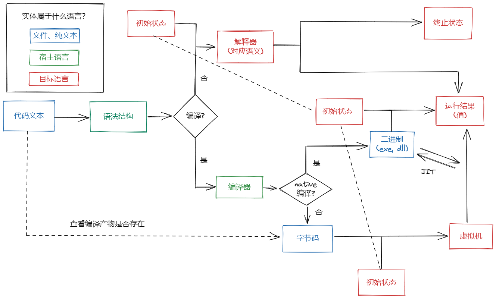

# 编程语言的设计和实现

<!-- include style -->

<!-- <link rel="stylesheet" href="https://cdn.jsdelivr.net/gh/highlightjs/cdn-release@11.6.0/build/styles/github.min.css"> -->

## 语法和语义

我们在讨论什么:
- 语法 (Syntax)
- 语义 (Semantics)

### 什么是语法 (Syntax)


语法 (syntax) 是指代码文本的规范，只有符合语法的代码才可能被编译器/解释器处理。

例如，`a = 1;` 是C语言的赋值语法，而 `a := 1` 在C语言中不合法。

其中，一个重要的概念是**语法结构**，它通常以语法树 (syntax tree) 的形式展现:

![AST Tree]


### 语法和 BNF

语法规则通常使用 BNF 文法定义。下面是四则运算的 BNF 文法：

```bnf
e : addsub

addsub : addsub '+' muldiv
       | addsub '-' muldiv
       | muldiv

muldiv : muldiv '*' atom
       | muldiv '/' atom
       | atom

atom : '(' e ')' | NUMBER
```

以下是此知识点涉及的习题，带着习题学习，能方便自行评估学习的效果。

*习题*

1. "`(1 + 1) + 1`"是否是合法的四则运算语言文本？

2. "`(1 / 2) + 1`"是否是合法的四则运算语言文本？

3. "`1.2`"是否是合法的四则运算语言文本？

4. 如果"1 + 1.2"对应**语法树**是 `Add(Int(1), Float(1.2))`，

   问："`1 + 1.2 * 2`"的语法树是？

#### 抽象语法树和具体语法树

根据BNF文法，我们将语言的文本解析为语法树——文本在语法规则下的结构化表示。

常用的语法树有两种：

1. 具体语法树 (CST)： 除开结构化语法外，事无巨细地记录源代码信息。*CST可以无损地转回源代码*。
2. 抽象语法树：只考虑后续工作需要的语法结构，抛弃了 CST 中对下游任务冗余的信息，如空白符，分隔符，缩进等。

举例子，给定一个语句 `a = 1;`, CST 与 AST 的差异通常如下图所示。

<style>
       .colsplit {
          width: 100%;
          border-collapse: collapse;
          padding: 2px;
       }
       .column {
            width: 50%;
            border: 1px solid black;
            text-align: center;
            padding: 8px;
       }
</style>

<div class="colsplit-container">
<table class="colsplit">
<tr>
<th> 具体语法树 </th>
<th> 抽象语法树 </th>
</tr>
<tr>
<td class="column">

```python
Statement(
    kind = "assign",
    children = [
       Variable("a"),
       Token("="),
       IntLiteral(1),
       Token(";")
    ]
)
```

</td>
<td class="column">

```python
Assignment(
    target=Variable("a"),
    value=IntLiteral(1)
)
```

</td>
</tr>
</table>
</div>

为了方便理解，上述两种语法树均进行了简化（例如略去行列号等），但仍然不难看出，**抽象语法树的信息比具体语法树更少，也更加紧凑**。

在涉及语法树的主要任务是编译、解释与各式代码分析，此类应用属于主流，一般只会用到抽象语法树，而无需具体语法树[^1]。**这意味着语言的具体语法通常不影响语言的运行**。

一门编程语言可以拥有多种具体语法，只要他们的语法结构和语义相同。语法不同、而语法结构与语义相同的语言之间，差异是表面的、不重要的，例如 `f(x, y, z)` 和 `call f with x, y, z`。

### 抽象语法树

> [!tip]
> 1. 抽象语法树是编译器/解释器工作的基础，通常作为编译器/解释器的输入。
> 2. 抽象语法树一般使用 ADT (代数数据类型) 来表达。
> ADT 的结构有 sort 和 constructor 两个关键概念。

抽象语法树一般表示为 ADT (代数数据类型 /Algebraic Data Type)。

使用 ADT 表示的语法树，常常被分为多个种类 (sort)，在绝大多数编程语言中，语法树有以下的 sort 划分：

- 表达式: 例如整数字面量表达式，函数调用表达式，二元运算表达式等。

- 语句：例如赋值语句，if语句等。

- 定义：例如数据类型定义，函数定义等。

由上可见，每一个 sort 都可能继续划分。每一个sort可能有一到多个构造器 (constructor)。

例如, 表达式 sort 有整数字面量、函数调用表达式和二元运算表达式这些 constructor：

```reasonml
Expr = IntLiteral(value: int)
     | FunctionCall(func: Expr, args: list<Expr>)
     | BinaryExpr(left: Expr, op: BinaryOperator, right: Expr)
     | ...
```
像上面这样能够描述 ADT 定义的语言，叫作抽象语法定义语言 (ASDL/Abstract Syntax Definition Language)。

我们会频繁使用 ASDL (及之前提到的 BNF 等) 格式来提高沟通效率。例如，以下是四则运算的语法树：

```reasonml
ArithExpr = Add(left: ArithExpr, right: ArithExpr)
          | Sub(left: ArithExpr, right: ArithExpr)
          | Mul(left: ArithExpr, right: ArithExpr)
          | Div(left: ArithExpr, right: ArithExpr)
          | Number(value: number)
```

可以看到，使用 ASDL/ADT 可以更加清晰地表达语法树的结构。

### 什么是语义

> [!tip]
> 1. **语义是对语法结构的解释**。
> 2. **解释方式是多样的，不同的语义产生不同的解释**。

解释方式是多样的，例如，打印语法树是一种可行的解释。

但在通用编程的语境下，人们一般关注的解释方式是代码执行 (evaluation) 。

不管对语法结构做何种解释，需要一套规则来描述解释过程。

以下框架提供了描述语义的常见手段:

> 语法结构 $X$ 的执行结果是 $r$ $\Longleftrightarrow$ $X \rightsquigarrow r$.

这里的 $X$ 是一个语法结构，如果对应编程概念，它是 host language (实现编译器、解释器所使用的语言) 中的一棵语法树 [^2]。

$$
X \in \text{语法树全集}
$$

这里的 $r$ 是一个**值**，如果对应编程概念，它是 target language (编译器、解释器运行最终代码所使用的语言) 中的一块运行时数据。为了方便，接下来的讨论中，<ins>**我们会预设 target language 是 Python** </ins>，以方便读者理解在 $r$ 上做的各种变换。

$$
r \in \text{Target Language值全集}
$$

上面这个框架，表达四则运算语言的语义绰绰有余：

$$
    \text{Add(Number(2), Number(2.0))} \rightsquigarrow 4.0
$$

但是，由于语法结构的具体数目是无限的，我们不能一一列举所有的语义规则。因此，我们需要采取一种递归的方式来描述语义，让这套递归规则能够覆盖所有的语法结构。

下面，我们依然以四则运算语言为例，给出一套可行的递归规则，介绍**相继式** (sequent) 和**操作语义** (operational semantics)。

### 相继式和操作语义

对于大多数语言来说，合法的语法结构是无限的，想想也知道，我们不能在一个语言规范手册里写下：

$$
    \text{Add}(1, \text{Add}(1, \text{Add}(\cdots,  \text{Add}(\text{Number}(1), \text{Number}(1))))) \rightsquigarrow 2992
$$

这里我们需要一个“注意到”。

> [!tip]
> 注意到语法结构的定义是递归的。
> 因此可以定义出一套递归的、有限的规则，为**合法语法结构的全体**描述语义。

为了做到这一点，我们介绍**相继式**：

$$
    P_1, P_2, \cdots, P_n \vdash Q
$$

这里的 $P_1, P_2, \cdots, P_n$ 是条件 (**前件**)，$Q$ 是结论 (**后继**)。

上面的公式，在逻辑上是一种断言 (assertion)，它表明在条件 $P_1, P_2, \cdots, P_n$ 都成立的情况下，基于规则 $\vdash$ 的推导能得到 $Q$。

相继式更重要的用途是描述推导过程，在实践上，你可以使用**前件**和**后继**这样的术语来强调 “现在我在讨论规则推导”。

形如 $P \vdash Q$ 的相继式，其整体可以作为条件，服务于更复杂的推导。例如，假设 $c_i$ 是一个相继式，那么我们可以有如下的推导：

<p align="center">
    $\dfrac{c_1 \;\; c_2 \;\; c_3 } {c_4} \Longleftrightarrow$ 在条件 $c_1 c_2 c_3$ 都成立的情况下，推导 $c_4$ 成立。
</p>

基于相继式，推演的逻辑可以层层嵌套，方便我们用一种规范性的方式，来描述包括编程语言语义在内的任何逻辑规则。

### 四则运算的操作语义

在开始之前，我们需要定义一些*元符号* (可以大致理解为宿主语言中的变量)，来让规则变得容易被纸笔描述：

```math
\begin{aligned}
& i, i_1, i_2 \cdots i_n \in \text{实数}  & \\
& X, Y \in \text{四则运算语言的语法结构全集} &  \\
& f(i_1, i_2),\; f \in \{\textbf{+, -, *, /}\}\;\;  \text{表示实数的加/减/乘/除} &   \\
\end{aligned}
```

借助这些元符号，我们定义四则运算语言的完整语义(乘法，除法，减法被省略)：

```math
\dfrac{X \rightsquigarrow i_1 \;\; Y \rightsquigarrow i_2 }{\text{Add}(X, Y) \rightsquigarrow \textbf{+}(i_1, i_2) } \qquad \dfrac{ }{ \text{Number}(i) \rightsquigarrow i}
```

此处有一些简化，不看也不影响:
> $\rightsquigarrow$ 两侧出现的 $i$ 实际上是不同的。他们身处不同的语言，就像文本 1 与 C++ 运行时整数 1 截然不同。在论文中，$\rightsquigarrow$ 左侧的 $i$ 常常表示一个文本，而右侧的 $i$ 表示一个 target language 中的数字，论文常常是有点过度严谨的，因为不仅需要从头定义 target language 的数据结构，还需要在推断过程中体现字面量的求值过程。


### 带状态的语义

在 Java 和 C++ 语言中，我们可以修改对象的字段。这是一种副作用，副作用会引起某些函数在参数相同时、返回值却不同。

```c++
static struct MyTypeRef *val = { ... };

int some_func(int factor)
{
    return val -> a * factor;
}

int main()
{
    int result1, result2;
    result1 = some_func(2.0);
    val -> a = 1; // 对象val的字段a被修改
    result2 = some_func(2.0);
    // result1 != result2, 副作用！
    return 0;
}
```

可以看到，C++ 的语义是有副作用的，因此我们方才介绍的 $X \rightsquigarrow r$ 这套表述不足以描述 C++ 语义：我们原先只考虑了返回值，但一些语言中，**语义涉及到副作用**。

副作用的本质是函数调用被**隐式**地增加了如下部分：
1. 一个**参数**: 表示全局状态
2. 一个额外的**返回值**: 表示函数修改后的全局状态

因此，当我们在 C++/JavaScript/Python 等主流语言中写下 `f(arg)` 的时候，我们实际上写下了类似 `[GLOBAL_STATE, result] = f(GLOBAL_STATE, arg)` 的代码。

对于具有副作用的语言，程序行为受全局状态影响。按照 PL 领域惯例，语义描述通常要求规则是完全透明的，没有隐式的预设，因而语义应当能够完全决定程序行为。所以，带有副作用的编程语言，在描述语义时必须同时描述全局状态的转移。在这种情况下，描述语义的框架通常是：

```math
(S, X) \longrightarrow (r, S)
```

该框架是非常痛苦的，因为如下四点：
1. 需要考虑的变量变多
2. 需要使用的符号变多
3. 推导公式将变得冗长
4. 描述副作用很无聊

上述第4点中的“无聊”一词并非情绪表达，而是一种通用的见解：TLDR; 副作用不是关键。

> 副作用在直观上理解起来非常容易，关于这一点，当下编程语言的流行情况已有明证；但是，要想使用公式系统将副作用描述清楚，工作量将会倍数增长，但关键的信息，如推导流程、情况分类、特殊语言特性等，却大同小异。

因此，在此段落后，表述将追求关键而不求精准。这就是说，虽然我们仍使用 $(S, X) \longrightarrow (r, S)$ 来描述关键状态的变化，但对于一些特殊的、我们不关心的副作用，例如 IO 等将被有意忽略。例如，当我们处理打印语句时，这里应当出现了一个函数调用，此调用实际做了打印、引发了副作用，但我们不关心这一点并将其视为一个空返回值的纯函数。

<details>

<summary> 所幸的是，这种“不正确”丝毫不影响我们精准地理解程序语言的语义，它是一种折衷。 </summary>

<div style="padding: 12px">
如果你真的需要“更正确”的框架描述来描述具有副作用的语言的语义，你可能需要接触Haskell的副作用观点，它巧妙地将副作用表示为状态初值 $S_0$ 上发生的一系列变换： $S_n = \textit{eff}_n(\cdots, \textit{eff}_2(\textit{eff}_1(S_0)))$。
</div>

</details>

此外，为了方便介绍，在本文后续部分，我们将认为语法结构是 host language 中的数据结构，而状态 $S$ 及返回值 $r$ 是 target language 中的数据结构。更进一步地，我们让 host language 等于 target language，这样一来，前文中 $\text{Number}(n) \rightsquigarrow n$ 的含义就非常明确了。

## 一个最简单的解释器

我们接下来讨论一个简单的语言，扩展的 $\Lambda$ 演算语言 (LC/Lambda Calculus)。

### LC的语法结构和语义

我们先用ASDL定义LC语法结构：

```reasonml
LC = Call(func: LC, arg: LC)
   | Var(varname: str)
   | Func(argname: str, body: LC)
```

可以看到 LC 的语法结构很简单，只有三种结构，分别是函数调用、读取变量和定义匿名函数。

LC的语义也很简单，只是我们不会像教材一样介绍LC的约归 (reduction) 规则，因为介绍相关知识对此阶段的实践没有帮助。之前说过，我们有 host language 和 target language (并且在本文中，两者是一个语言)，我们要立刻将 LC 用一个实际的语言表达，以建立直觉。

让我们选择 Python = target language = host language。本文之后提到target language，若非特殊说明，都指Python。

为了给出语义，我们还需要定义一些辅助物件。

我们需要一个状态 $S$，它表示 LC 的作用域，在 target language 中，你可以用 Python 的字典来想象它，想象它是一个从字符串到 target language 运行时对象的映射。

<p align="center">
    $S = (a_1 \mapsto r_1) (a_2 \mapsto r_2)  \cdots (a_n \mapsto r_n)$
</p>

其中，$a_1, \cdots, a_n$ 可以理解为 target language 中的字符串。

LC语义如下，其中 $r, r_f, r_1, \cdots r_n$ 是 target language 中的值，这样的值如果是函数，则是一个数学上的纯函数 $f: (S, r) \mapsto (r', S') $。

**规则1: 变量查找**

```math
\dfrac{}{ (a_1 \mapsto v_1) \cdots (a_n \mapsto v_n), \text{Var}(a_k) \longrightarrow v_k, (a_1 \mapsto v_1) \cdots (a_n \mapsto v_n) } \\
```

**规则2: 函数调用**

```math
\dfrac{  S, X_f \rightarrow \text{Func}(a, X_{\text{body}}), S' \quad S', X_{\text{arg}} \rightarrow r_{\text{arg}}, S'' \quad (a \mapsto  r_{\text{arg}}) S'', X_{\text{body}} \rightarrow r_{\text{ret}}, S''' }{ S, \text{Call}(X_f, X_{\text{arg}}) \longrightarrow r_{ret}, S' }
```

> [!tip]
> 在我们的语义中，$S$ 仅表示作用域，此时函数调用返回的状态应该被抛弃，即最后的
> 状态是 $S''$ 而不是 $S'''$。
>
> 但是，如果 $S$ 中包含了其他的副作用，如 IO、内存分配，则相关副作用会在函数调用之后继续继承。
>
> 因此，语义中可能存在多种不同的副作用，它们处理方式各不相同，整体处理难度可见一斑。但不必因此灰心，在具体的程序实现中，副作用的处理是简单的。

**规则3: 函数定义**

```math
\begin{align}
\dfrac{ }{
    S^{*}, \text{Func}(a, X) \longrightarrow \text{Func}(a, X), S^{*}
} \\
\end{align}
```

我们之前提过，任何语法结构，如 $\text{Func}(a, X)$ 和 $X$，都是 host language 中的数据结构，而我们又使用了 target langauge = host language 这一方便的假设，因此实际上直接将语法结构作为函数对象的值来存储。

> [!tip]
> 在实践中，函数定义时期应当做进一步处理来优化性能、方便实现。这些处理将 AST 转换成更紧凑、更静态、更方便获取所需运行时信息的结构（即，编译），例如在 Python 中，函数定义会被转换为基于 Code Object 的简单包装器 (`types.FunctionType`)，而核心的 Code Object 中则包含字节码指令序列、常量缓存池、各种名字用到的字符串对象池等。

<!-- define images -->
[AST Tree]: ./static/interpreter-ast-tree.png

<!-- define references -->

[^1]: CST 通常用于 IDE intellisense、unopionated 格式化工具。在 intellisense 场景下，语法结构可能随着少量源码变更却发生剧烈变化，也可能出现不完全的语法结构，因此难以使用简洁、静态定义的 AST 来表达；在非强制风格的格式化工具中，分析器可通过 CST 获取编码风格的细节。

[^2]: 在主流的 PL (Programming Language) 研究中，通常是基于字符串的模式匹配、而不是基于 AST 的模式匹配来描述语言。这里使用 AST 是为了方便后续几处的表述更为直观、简洁。

*习题*

按照上述语义，LC 语言是否支持“闭包 (closure)”？读者须自行了解什么是闭包。

### LC 扩展、原语函数

虽然 LC 语言是一种和图灵机一样强力的底层模型，但如果不在其中引入一些我们熟知的语言构造，它就没有什么实用价值。 虽然可以利用 [Church encoding](https://en.wikipedia.org/wiki/Church_encoding) 将整数、布尔、if-else 等高级语言构造拆解为 LC 表示，但此表示对实际编程不适用。

我们对 LC 进行扩展，添加布尔、数字、字符串、原语函数等。

```reasonml
LC = Call(func: LC, args: LC)
   | Var(varname: str)
   | Func(argname: str, body: LC)
   // 扩展
   | BoolVal(value: bool)
   | NumberVal(value: number)
   | StringVal(value: str)
   | Prim(name: str)
```

原语函数 (primitive functions) 是一种特殊函数，它是 source language 在概念上所内置的函数，是语言本身的一部分，而非用户所定义。

<details>

<summary>
原语函数有时被称为内建函数 (builtin functions) 或 intrinsic functions (固有函数)。三者在实践上有一定程度的混用，但它们之间存在差异。
</summary>

<p>
primitive 蕴含包含正交性和不可分割性，而 instrinsic 则更强调语言与生俱来、如同公理一般的特性，而 builtin 则包含了两者的特性。
</p>

</details>

那么原语函数有什么用？很简单，如果没有原语函数，你甚至很难做到下面的事情：

1. 数字加法
2. 数字打印

原语函数是编程语言访问物理计算机能力的接口，它很重要，因为编程语言是屏蔽物理计算机细节的中间层，最终还是要落实到真实的计算。

<details>
<summary>
Idris 原语函数 <code> op_str_concat </code> 的例子
</summary>

著名的实用派函数式语言 Idris，会预设一些特殊名字的函数存在，例如，Idris 语言没有定义函数 `op_str_concat`，但任何字符串拼接操作最后都会调用到它，因此 Idris 语言本身无需依赖字符串的实现方式。`op_str_concat` 这样的函数被称为原语函数，它被预设存在，以提供语言最基本的、不可划分的操作。

</details>

对于任意一个合法的原语函数 $p: (S, r) \mapsto (r, S)$，获取它的语法 (对应的语法树) 可能是 `Prim(name: str)`，其执行结果是一个原语函数 $p$，因此 $p$ 应当可以根据一个名字 $a$ 查询出来。

$$
p = \text{LookUpPrim}(a)
$$

我们可以定义原语函数 $p: (S, r) \mapsto (r, S)$ 的语义，分成两部分，一部分是定义，一部分是调用。

**原语函数定义**

```math
\dfrac{  } {
    (S, \text{Prim}(a)) \longrightarrow (\text{Prim}(a), S)
}
```

语法树还是直接作为值使用。

**原语函数调用**

```math
\dfrac{
    p = \text{LookUpPrim}(a)
    \quad
    S, X \rightarrow r_{arg}, S'
    \quad
    (r', S') = p(S, r_{arg})
}{
    S, \text{Call}(\text{Prim}(a), X) \longrightarrow r', S'
}
```

*习题*

尝试给出 $\text{BoolVal}$ , $\text{NumberVal}$ 和 $\text{StringVal}$ 的语义？


### 扩展 LC 的解释器实现 (Python)

现在，让我们根据前面给出的LC语义，在Python语言 (建议Python 3.10以上) 中实现扩展LC的解释器。

```python
from __future__ import annotations
from dataclasses import dataclass
from typing import Any

@dataclass(frozen=True)
class Call:
    func: LC
    arg: LC

@dataclass(frozen=True)
class Func:
    name: str
    body: LC

@dataclass(frozen=True)
class Var:
    name: str

@dataclass(frozen=True)
class Prim:
    name: str

# TODO: 自行实现 LC 的其他 constructor
# NumberVal, BoolVal, StringVal
...

# TODO: 自行实现 LookUpPrim
def lookup_prim(name: str):
    # TODO
    ...

# 定义sort
LC = Var | Func | Call | Prim | NumberVal | BoolVal | StringVal

def eval_lc(S: dict[str, Any], X: LC) -> tuple[Any, S]:
    if isinstance(X, Var):
        return S[X.name], S
    ...  # TODO: 自行实现
```

> [!tip]
> 1. 可以尝试支持一些原语函数，例如加、减、乘、除和打印

## LC的语法解析

欢迎来到编译器最平凡的部分，语法解析 (parsing)。

除开产出学术成果的研究需要，**否则强烈建议不要在 parsing 上浪费任何的时间**。

### 实用主义的 parsing 技术选型

解析器从源代码文本中提取语法结构，这个语法结构通常指抽象语法树。

相应的语法解析技术，具体来说有很多，例如手工递归下降法、parser generator 和 parser combinator 等。

通常来说，解析器需要着重报错与表达力，但对极限性能的需求则相当虚拟。使用ANTLR4 (一个实用的 parser 生成器框架)，按照 lua 规范实现一个 lua 解析器，这样的解析器中会存在相当多的歧义，多少会导致性能问题。但在实践中，上面这样“低质量”的 lua 解析器一秒钟能解析接近10万行来自 real world 的工业代码，这种性能足以让 IDE 分析工具在你每一次落键瞬间重新解析、分析当前文件并更新补全信息。

因此，建议读者大胆地去使用那些表现力足够强、报错足够好的解析器生成器，例如 ANTLR4, Python Lark 等等；parser combinator/parsec 也可以用，报错机制会更灵活，但做事情会慢一些；需要小心那些 LL(1)/LR(1) 解析器，如果你不算parser 专家，或者不想浪费生命去纠结为什么你的文法不工作。

此文章将使用 Python 的 Lark 来演示。它的性能其实非常差，但因为非常实用，被大量重要的 Python 开源项目使用 —— 从这里也可以看出，解析器性能很多时候并非关键。

### 基于 Python Lark 来解析 LC 语法

```abnf
start : lc

lc    : call
      | atom

call   : call atom
       | atom

atom  : CNAME
      | func
      | prim
      | number
      | boolean
      | string
      | "(" lc ")"

string : ESCAPED_STRING
number : NUMBER
boolean: "true" | "false"
var    : CNAME
func   : "func" "(" CNAME ")" "{" lc "}"
prim   : '@' CNAME

%import common.WS               // 这是空白符token
%import common.ESCAPED_STRING   // 这是双引号字符串token
%import common.CNAME            // 这是C标志服token
%import common.NUMBER           // 这是数字token
%ignore WS                      // 忽略所有空白符
```

这个文法被一行代码的 Lark 编译工具处理后，可以生成一个 LC 语言的解析器，具体可参考 [json_parser全流程](https://lark-parser.readthedocs.io/en/latest/json_tutorial.html)。由于这个解析器输出的是具体语法树 (CST)，你可能需要手动转换CST到AST。

出于可读性和可维护性的考虑，CST 到 AST 的转换最好在文法中进行 (参考语法制导，或semantic actions)。虽然关于这一点常常有一些相反意见，但[Python的发展生动地说明了这点](https://peps.python.org/pep-0617/#intermediate-parse-tree)。对此，我的建议是努力地使用语法制导，**但绝不在文法中引入构造 AST 以外的逻辑**。

```abnf
// 一个好的使用semantic action的例子
lc_atom : CNAME   -> Var(token_to_string($1))
        | "true"  -> BoolVal(True)
        | "false" -> BoolVal(False)
        | ...
```

现在，使用 Lark 或者别的你觉得趁手的解析器生成工具，为 LC 语言生成一个解析器。

如果你觉得这个工作很无聊或者不好办，可以无情地使用以下步骤获得一个 parser：

0. 安装 Python 并激活环境: [https://conda-forge.org/miniforge](https://conda-forge.org/miniforge/)

1. 创建一个项目文件夹 `intp_exercise`。

2. 新建`lc_ast.py`，将扩展LC语言的所有语法结构 (`Call`, `Prim`, `Var`, `Func`, `NumberVal`等) 以及前面 `eval_lc` 函数，放入 `lc_ast.py` 中。

3. 在文件夹中创建文件 `lc1.lark`，在文件夹中创建文件 `lc1.lark`，内容如下:

    ```python
    %%
    from lc_ast import *
    %%

    start : lc             -> $1
    lc    : lc atom        -> Call($1, $2)
          | atom           -> $1
    atom  : CNAME          -> Var($1.value)
          | '@' CNAME      -> Prim($2.value)
          | NUMBER         -> NumberVal(eval($1.value))
          | "true"         -> BoolVal(True)
          | "false"        -> BoolVal(False)
          | ESCAPED_STRING -> StringVal(eval($1.value))
          | "(" lc ")"     -> $2
          | "func" "(" CNAME ")" "{" lc "}" -> Func($3.value, $6)

    %import common.WS               // 这是空白符token
    %import common.ESCAPED_STRING   // 这是双引号字符串token
    %import common.CNAME            // 这是C标志服token
    %import common.NUMBER           // 这是数字token
    %ignore WS                      // 忽略所有空白符
    ```
4. 运行命令 `pip install lark-action`, 安装 `lark-action` 包

5. 在文件夹`intp_exercise/`下运行：

    ```bash
    python -m lark_action lc1.lark --package="" --module="lc"
    ```

6. `lc_run.py` 内容如下：

    ```python
    # lc_run.py

    from lc import parser
    from lc_ast import eval_lc

    def add(ctx, x):
        def addx(ctx, y):
            return y, ctx
        return addx, ctx

    S = { 'add': add }

    def run_code(source_code):
        r, _ = eval_lc(S, parser.parse(source_code))
        print("执行结果为:", r)

    run_code("add 1 2") # 3
    run_code("(func (x) {add 2 x})(3)") # 5
    ```

7. 执行命令 `python lc_run.py`。


按照上述步骤，你将可以运行扩展后的 LC 语言，前提是你完成了[扩展 LC 的解释器实现 (Python)](#扩展-lc-的解释器实现-(python))的代码习题。

改动 `lc_run.py` 的代码，多看看效果。

*习题*

尝试实现一个REPL (Read-Eval-Print-Loop)。


## 更丰富的语言构造: 变量绑定、if, while

虽然我们已经完成一个有模有样的解释器，但它目前仍很不实用。

该如何赋值呢？我们甚至不能使用 `x = 1` 这样的代码。

此外，函数体也只能支持“一句话”，而不能支持多行，就像下面这样：

```go
func (x)
{
    display x
    add x x
}
```

要支持上述能力，我们引入两种新的语法结构：

**变量绑定**

- 语法结构: `Assign(name: str, expr: LC)`
- 语义:

    ```math
    \dfrac{ S, X \longrightarrow r, S' }{
        S, \text{Assign}(a, X) \longrightarrow r, (a \mapsto r) S'
    }
    ```

**语句块**

- 语法结构: `Block(body: list<LC>)`
- 语义:

    ```math
    \dfrac{ S_0, X_1 \longrightarrow r_1, S_1 \quad S_1, X_2 \longrightarrow r_2, S_2  \;\cdots\;  S_{n-1}, X_n \longrightarrow r_n, S_n
    }{
        S_0, \text{Block}(X_1 X_2 \cdots X_n) \longrightarrow r_n, S_n
    }
    ```

*习题*

尝试在 lc1.lark 中为 Assign 和 Block 加入合适的语法规则，以支持下面的代码：

```go
func (x)
{
    x = add x x;
    x = add x 1;
    x
}
```

*习题*

尝试实现以下语言扩展，让我们的语言看起来更“工业界”：

1. 具名函数：目前实现的LC解释器，函数均为匿名
2. if语句
3. while语句
4. return语句
5. 多参数函数
6. break, continue

此外，还可以实现相应的REPL以及文件输入执行功能。

本页面已帮助我的一名实习生掌握了基本的编译、解释技术，项目链接如下，可作为参考实现：

<p style="text-align: center;">
    https://github.com/April-ZhouQian/interpret
</p>


在后续章节，我们将基于上述参考实现，实现相应语言的字节码编译器。

## 字节码编译 (待完成)

如果运行前面解释器的参考实现，可以发现，性能比Python还要低好几个数量级。

```reasonml
LC = Call(func: LC, args: LC)
   | Var(varname: str)
   | Func(argname: str, body: LC)
   | BoolVal(value: bool)
   | NumberVal(value: number)
   | StringVal(value: str)
```

回顾语义的描述方式，我们使用 $S, X \longrightarrow r, S'$ 的表述框架，而编译可以视为对这个过程的一个拆解。



我们考虑上图的如下流程：

1. 语法结构到字节码。将其用 $X \overset{\text{compile}}{\longrightarrow} I_1 I_2 \cdots I_n$ 的形式描述。
2. 字节码到运行时值，即虚拟机解释。将其用 $S, I \overset{\text{VM}}{\longrightarrow} r, S$ 的形式描述。

我们会先介绍 $\overset{\text{VM}}{\longrightarrow}$，但初学者可能因此丢失语境。对此，我们先介绍一个简单例子以方便读者建立直觉。

<div class="colsplit-container">
<table class="colsplit">
<tr>
<th> 源码 </th>
<th> 字节码 </th>
</tr>
<tr>
<td class="column">

```python
x = add(x, 1)
```

</td>
<td class="column">

```ocaml
LOAD_VAR add
LOAD_VAR x
LOAD_CONST 1
LOAD_CONST 2
CALL_FUNCTION 2
STORE_VAR x
```

</td>
</tr>
</table>
</div>

